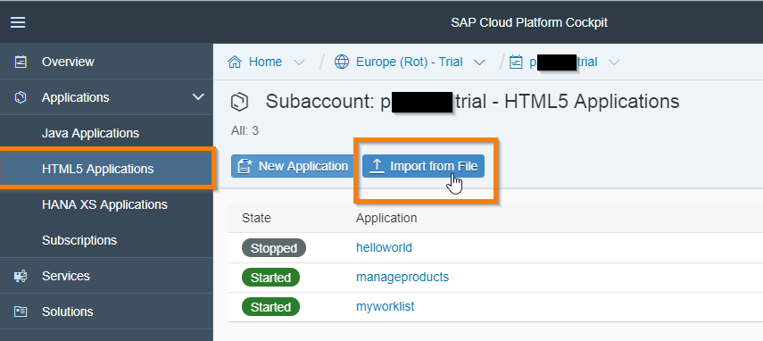
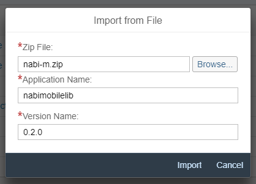
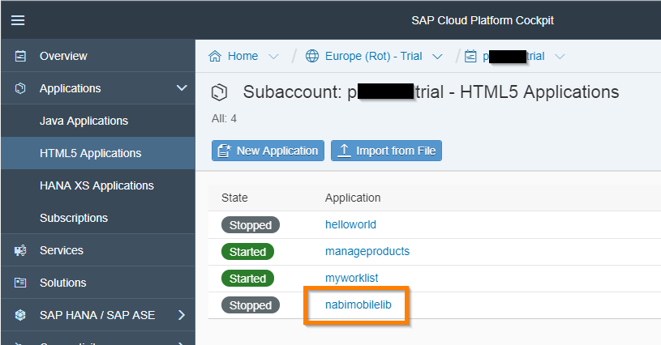
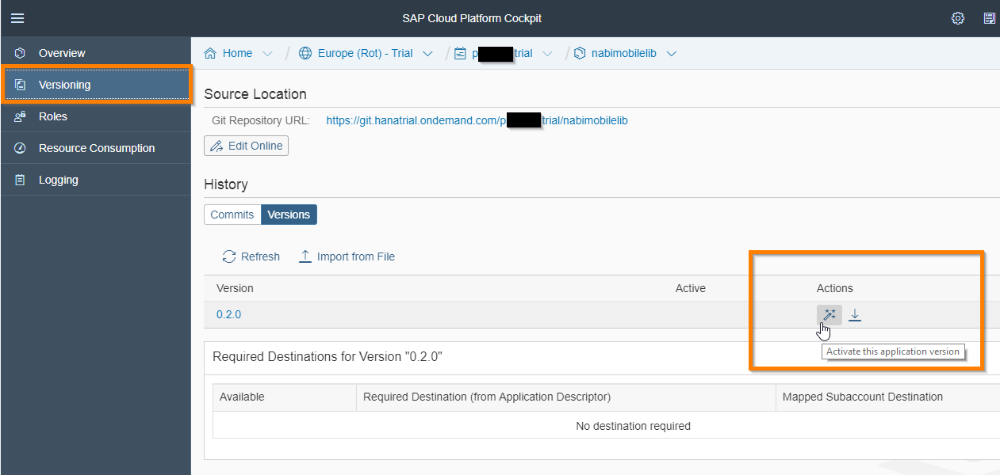
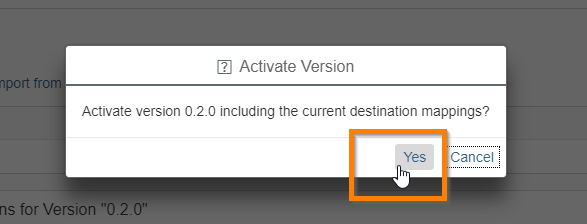
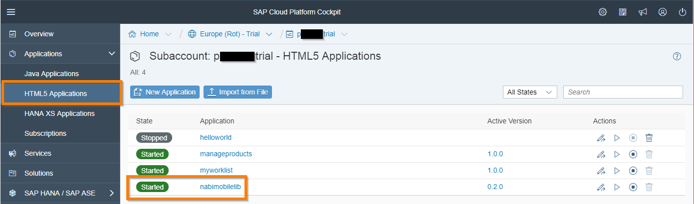

# Deployment of nabi.m to SAP Cloud Platform (SAPCP)

## Before Deployment

1. Install all npm dependencies (also installs all bower dependencies)
    ```sh
    npm install
    ```


## SAP Cloud Platform (SAPCP)

Deploying to SAPCP can be achieved via in multiple ways, i.e. using the Web IDE. However, if your are not using the Web IDE you can still deploy by using the SAPCP Cockpit:

1. Lint + build the library
    ```sh
    grunt lint build
    ```

    **Hint:** This will create a file **nabi-m.zip** in the dist folder. This is the file yo want to uplöoad in the next step.

1. In your SAP Cloud Platform Cockpit got to HTML5 Applications an press **Import from File**

    


1. Select the library zip file, choose a name and a verison **Import**

    


1. Click the application name you have chosen under **HTML5 Applications**

    


1. Under **Versioning** press the **Activate** button for the version you just uploaded

    


1. Confirm the dialog in case it showes up

    


1. The app should be started now

    
