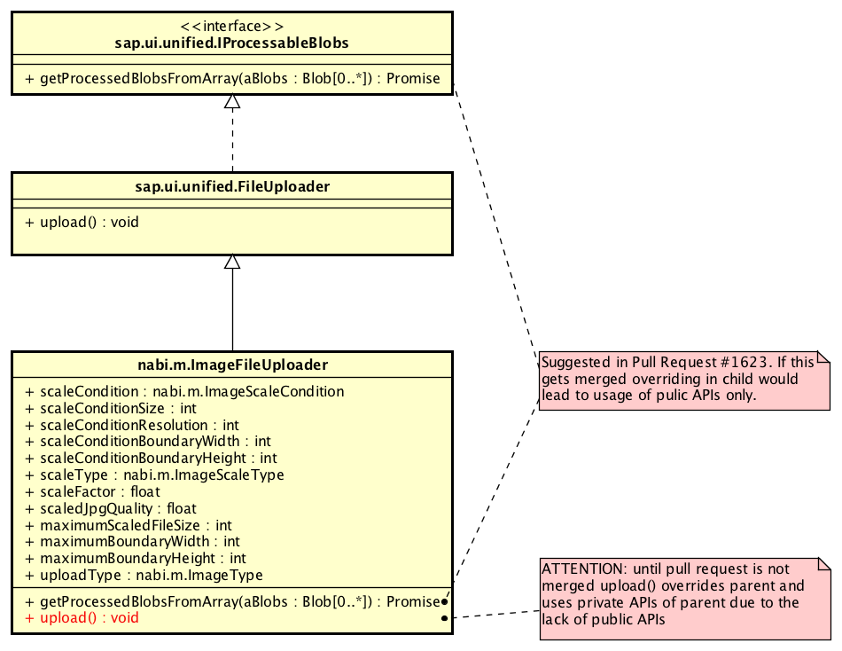

# nabi.m.ImageFileUploader

Allows you to scale images before they get uploaded.

## How it works behind the scenes

The `nabi.m.ImageFileUploader` control extends the `sap.ui.unified.FileUploader` control. Unfortunately, the `nabi.m.ImageFileUploader` uses private APIs of `sap.ui.unified.FileUploader` which is a very bad practice (see all `fixme` hints in this control's code). However, this was the easiest/fastest way to leverage from the amazing code that already exists (think about the renderer incl. not losing file input values on re-rendering, i18n, accessibility, parameters, OData support,...). As soon as SAP offers a clean way for overwriting the right methods (public APIs, interface,…) I will migrate this control. In fact, I have a suggestion, see [my pull request 1623 on Github](https://github.com/SAP/openui5/pull/1623). As long as the pull request is not accepted make sure to test this control with your version of UI5 (and yes, I will write some automated tests soon) – and do that every time you upgrade your UI5 version! The following [astah UML diagram](nabi.m.ImageFileUploader.astah) shows what properties are added (for simplicity only relevant properties/methods are listed, generated getters/setter are not listed). Together with the comments/jsdoc in the code this should help you understand the details of my implementation.

`nabi.m.ImageFileUploader` allows only XHR file uploads. Thus, `setSendXHR` is overridden in order to disallow changing its value. Currently, `nabi.m.ImageFileUploader` overrides `upload()` and uses private APIs of `sap.ui.unified.FileUploader` in there. This will be changed in the future, see the pull request mentioned sbove.





The magic happens behind the scenes with plain old JavaScript / HTML5. However, files are uploaded using FormData and XHR. Scaling of the files is based on HTML5 Canvas and the File API (`window.File`). As you can guess this means that the control is not supported by Internet Explorer 9. That’s ok, because officially SAPUI5 does not support IE 9 anymore anyway. In fact, currently [SAPUI5 officially supports IE11+](https://sapui5.hana.ondemand.com/#docs/guide/74b59efa0eef48988d3b716bd0ecc933.html) and thus I have no pain not supporting IE9.

What about the image quality?
-----------------------------
Using HTML5 Canvas for scaling images down (“down sampling”) comes in pretty handy for us as we don’t have to deal with all the [math](https://en.wikipedia.org/wiki/Image_scaling#Mathematical); instead we let the browser handle the process of down sampling for us. Down sampling means “decreasing the pixel number (scaling down), and this usually results in a visible quality loss” ([Wikipedia](https://en.wikipedia.org/wiki/Image_scaling)). Using HTML5 Canvas might not always be the best option in terms of quality. However, it might be enough for lots use cases. In future, I might introduce an API allowing you to use something different than HTML5 Canvas, i.e. your own down sampling algorithm ([Wikipedia](https://en.wikipedia.org/wiki/Image_scaling#Algorithms)).

## Examples

All the examples below can be found in the UI5Lab Browser. For details see the sections "Getting Started" and "Directions" of the [README.md](../../README.md). Following the directions allows you to try the examples out on localhost.

### 1. Scaling Down by Factor

The default scaleType is `nabi.m.ImageScaleType.Factor` (“Factor”). This simple example uses a `scaleFactor` of `0.5`, meaning the image will be scaled down by 50%. You know most of the properties from the `sap.ui.unified.FileUploader`.

```js
var oImageFileUploader = new nabi.m.ImageFileUploader({
	scaleFactor : 0.5,
	uploadUrl: "{/uploadUri}",
	uploadOnChange : true,
	uploadComplete : function (oEvent) {
		var sStatus = oEvent.getParameter("status");
		if (sStatus === 200) {
			sMsg = "Return Code: 200 "	;
			oEvent.getSource().setValue("");
		} else {
			sMsg = "Error Code: " + sStatus;
		}
		sap.m.MessageToast.show(sMsg);
	}
});
oImageFileUploader.placeAt("content");
```


### 2. Allowing only PDF, JPEG, PNG in File Selector

However, the previous example allows users to upload any file. If you want to allow only PDF, JPEG, or PNG files to be selectable from the file selection dialog then you could simply use the `mimeType` property of `sap.ui.unified.FileUploader` (see code below). In contrast, you could also use its `fileType` property to allow selecting any file but not allowing upload on any file.

```js
var oImageFileUploader = new nabi.m.ImageFileUploader({
	scaleFactor : 0.5,
	mimeType: [nabi.m.MimeType.PDF, nabi.m.MimeType.JPEG, nabi.m.MimeType.PNG],
	uploadUrl: "{/uploadUri}",
	uploadOnChange : true,
	uploadComplete : function (oEvent) {
		var sStatus = oEvent.getParameter("status");
		if (sStatus === 200) {
			sMsg = "Return Code: 200 "	;
			oEvent.getSource().setValue("");
		} else {
			sMsg = "Error Code: " + sStatus;
		}
		sap.m.MessageToast.show(sMsg);
	}
});
oImageFileUploader.placeAt("content");
```

### 3. Using Max Boundaries and Max Scaled File Size

In case you to want to scale images based on max width and/or max height, you can use the `scaleType` `nabi.m.ImageScaleType.Boundary` (“Boundary”). Additionally, you can set your `maximumBoundaryWidth` and/or `maximumBoundaryHeight` (pixels). With the configuration below images are only scaled down if the initial width and/or height of the images exceed the specified boundary values. The proportions of the images stay intact. Additionally, the property `maximumScaledFileSize` allows to make sure that the scaled files are not uploaded if they are (still) too large; you can handle that with the event `maxScaledFileSizeExceed`.

```js
var oImageFileUploader = new nabi.m.ImageFileUploader({
	scaleType : nabi.m.ImageScaleType.Boundary,
	maximumScaledFileSize : 1024 * 1024 * 3,	// 3 MB
	maximumBoundaryWidth : 1680,
	maximumBoundaryHeight : 1050,
	mimeType: [nabi.m.MimeType.PDF, nabi.m.MimeType.JPEG, nabi.m.MimeType.PNG],
	uploadUrl: "/upload",
	uploadOnChange : true,
	maxScaledFileSizeExceed : function(oEvent){
		var filename, filesize, maxSize, diff;
		filename = oEvent.getParameter("fileName");
		filesize = oEvent.getParameter("fileSize");
		maxSize = oEvent.getSource().getMaximumScaledFileSize();
		diff = filesize - maxSize;
		sap.m.MessageToast.show(filename + " has " + filesize + " bytes which is " + diff + " bytes more than the max of " + maxSize + " bytes.");
	},
	uploadComplete : function (oEvent) {
		var sStatus = oEvent.getParameter("status");
		if (sStatus === 200) {
			sMsg = "Return Code: 200 "	;
			oEvent.getSource().setValue("");
		} else {
			sMsg = "Error Code: " + sStatus;
		}
		sap.m.MessageToast.show(sMsg);
	}
});
oImageFileUploader.placeAt("content");
```


### 4. Forcing Image File Type to JPEG (file conversion)

Using the `uploadType` allows you to convert images after they have been scaled to a given image type. Currently only “jpg” and “png” is supported. The value `nabi.m.ImageType.Default` (“Default”) for `uploadType` means “just use the type of the initial file, whatever that is”. The code below also sets the `scaledJpgQuality` to 1. This is only used for JPG files and influences the quality of the scaled outcome. You could use 0.5 for “50% of the initial quality”.

```js
var oImageFileUploader = new nabi.m.ImageFileUploader({
	scaleType : nabi.m.ImageScaleType.Boundary,
	maximumScaledFileSize : 1024 * 1024 * 3,	// 3 MB
	maximumBoundaryWidth : 1680,
	maximumBoundaryHeight : 1050,
	uploadType : nabi.m.ImageType.jpg,
	scaledJpgQuality : 1,
	mimeType: [nabi.m.MimeType.PDF, nabi.m.MimeType.JPEG, nabi.m.MimeType.PNG],
	uploadUrl: "/upload",
	uploadOnChange : true,
	maxScaledFileSizeExceed : function(oEvent){
		var filename, filesize, maxSize, diff;
		filename = oEvent.getParameter("fileName");
		filesize = oEvent.getParameter("fileSize");
		maxSize = oEvent.getSource().getMaximumScaledFileSize();
		diff = filesize - maxSize;
		sap.m.MessageToast.show(filename + " has " + filesize + " bytes which is " + diff + " bytes more than the max of " + maxSize + " bytes.");
	},
	uploadComplete : function (oEvent) {
		var sStatus = oEvent.getParameter("status");
		if (sStatus === 200) {
			sMsg = "Return Code: 200 "	;
			oEvent.getSource().setValue("");
		} else {
			sMsg = "Error Code: " + sStatus;
		}
		sap.m.MessageToast.show(sMsg);
	}
});
oImageFileUploader.placeAt("content");
```

### 5. Using Scale Condition "Boundary"

Using the `scaleCondition` `nabi.m.ImageScaleCondition.Boundary` allows you to only scale down images in case their initial resolution (width x height) exceeds a certain width or height. If that’s the case the images gets scaled down based of the `scaleTypen` (in the example `nabi.m.ImageScaleType.Boundary` below). The default for `scaleCondition` is `nabi.m.ImageScaleCondition.None`, which means always scale images without checking any condition.

```js
var oImageFileUploader = new nabi.m.ImageFileUploader({
	scaleType : nabi.m.ImageScaleType.Boundary,
	maximumScaledFileSize : 1024 * 1024 * 3,	// 3 MB
	maximumBoundaryWidth : 1680,
	maximumBoundaryHeight : 1050,
	scaleCondition : nabi.m.ImageScaleCondition.Boundary,
	scaleConditionBoundaryWidth : 1680,
	scaleConditionBoundaryHeight : 1050,
	mimeType: [nabi.m.MimeType.PDF, nabi.m.MimeType.JPEG, nabi.m.MimeType.PNG],
	uploadUrl: "/upload",
	uploadOnChange : true,
	maxScaledFileSizeExceed : function(oEvent){
		var filename, filesize, maxSize, diff;
		filename = oEvent.getParameter("fileName");
		filesize = oEvent.getParameter("fileSize");
		maxSize = oEvent.getSource().getMaximumScaledFileSize();
		diff = filesize - maxSize;
		sap.m.MessageToast.show(filename + " has " + filesize + " bytes which is " + diff + " bytes more than the max of " + maxSize + " bytes.");
	},
	uploadComplete : function (oEvent) {
		var sStatus = oEvent.getParameter("status");
		if (sStatus === 200) {
			sMsg = "Return Code: 200 "	;
			oEvent.getSource().setValue("");
		} else {
			sMsg = "Error Code: " + sStatus;
		}
		sap.m.MessageToast.show(sMsg);
	}
});
oImageFileUploader.placeAt("content");
```

### 6. Using Scale Condition "Resolution"

Using the `scaleCondition` `nabi.m.ImageScaleCondition.Resolution` allows you specify a max resolution of the initial image. If that resolution is exceeded the scaling kicks in – again based on the `scaledType`.

```js
var oImageFileUploader = new nabi.m.ImageFileUploader({
	scaleType : nabi.m.ImageScaleType.Boundary,
	maximumScaledFileSize : 1024 * 1024 * 3,	// 3 MB
	maximumBoundaryWidth : 1680,
	maximumBoundaryHeight : 1050,
	scaleCondition : nabi.m.ImageScaleCondition.Resolution,
	scaleConditionResolution : 1680 * 1050,
	mimeType: [nabi.m.MimeType.PDF, nabi.m.MimeType.JPEG, nabi.m.MimeType.PNG],
	uploadUrl: "/upload",
	uploadOnChange : true,
	maxScaledFileSizeExceed : function(oEvent){
		var filename, filesize, maxSize, diff;
		filename = oEvent.getParameter("fileName");
		filesize = oEvent.getParameter("fileSize");
		maxSize = oEvent.getSource().getMaximumScaledFileSize();
		diff = filesize - maxSize;
		sap.m.MessageToast.show(filename + " has " + filesize + " bytes which is " + diff + " bytes more than the max of " + maxSize + " bytes.");
	},
	uploadComplete : function (oEvent) {
		var sStatus = oEvent.getParameter("status");
		if (sStatus === 200) {
			sMsg = "Return Code: 200 "	;
			oEvent.getSource().setValue("");
		} else {
			sMsg = "Error Code: " + sStatus;
		}
		sap.m.MessageToast.show(sMsg);
	}
});
oImageFileUploader.placeAt("content");
```

### 7. Using Scale Condition "Size"

The `scaleCondition` `nabi.m.ImageScaleCondition.Size` makes the scaling only kick in if the initial file size specified with `scaleConditionSize` (in bytes) is exceeded. This time, the example below uses the `scaleType` `nabi.m.ImageScaleType.Factor` (default, that’s why it can be omitted). In that case `maximumBoundaryWidth` and `maximumBoundaryHeight` are ignored.

```js
var oImageFileUploader = new nabi.m.ImageFileUploader({
	scaleType : nabi.m.ImageScaleType.Boundary,
	maximumScaledFileSize : 1024 * 1024 * 3,	// 3 MB
	maximumBoundaryWidth : 1680,
	maximumBoundaryHeight : 1050,
	uploadType : nabi.m.ImageType.jpg,
	scaleCondition : nabi.m.ImageScaleCondition.Size,
	scaleConditionSize : 1024 * 1024 * 5,			// 5 MB
	mimeType: [nabi.m.MimeType.PDF, nabi.m.MimeType.JPEG, nabi.m.MimeType.PNG],
	uploadUrl: "/upload",
	uploadOnChange : true,
	maxScaledFileSizeExceed : function(oEvent){
		var filename, filesize, maxSize, diff;
		filename = oEvent.getParameter("fileName");
		filesize = oEvent.getParameter("fileSize");
		maxSize = oEvent.getSource().getMaximumScaledFileSize();
		diff = filesize - maxSize;
		sap.m.MessageToast.show(filename + " has " + filesize + " bytes which is " + diff + " bytes more than the max of " + maxSize + " bytes.");
	},
	uploadComplete : function (oEvent) {
		var sStatus = oEvent.getParameter("status");
		if (sStatus === 200) {
			sMsg = "Return Code: 200 "	;
			oEvent.getSource().setValue("");
		} else {
			sMsg = "Error Code: " + sStatus;
		}
		sap.m.MessageToast.show(sMsg);
	}
});
oImageFileUploader.placeAt("content");
```

### 8. Using Scale Condition "Any"

If you want to scale down the image in case any of the possible conditions applies you can simply use `nabi.m.ImageScaleCondition.Any` for the `scaleCondition`.

```js
var oImageFileUploader = new nabi.m.ImageFileUploader({
	scaleType : nabi.m.ImageScaleType.Boundary,
	maximumScaledFileSize : 1024 * 1024 * 3,		// 3 M
	maximumBoundaryWidth : 1680,
	maximumBoundaryHeight : 1050,
	scaleCondition : nabi.m.ImageScaleCondition.Any,
	scaleConditionSize : 1024 * 1024 * 5,			// 5 MB
	scaleConditionResolution : 1680 * 1050,
	scaleConditionBoundaryWidth : 1680,
	scaleConditionBoundaryHeight : 1050,
	mimeType: [nabi.m.MimeType.PDF, nabi.m.MimeType.JPEG, nabi.m.MimeType.PNG],
	uploadUrl: "/upload",
	uploadOnChange : true,
	maxScaledFileSizeExceed : function(oEvent){
		var filename, filesize, maxSize, diff;
		filename = oEvent.getParameter("fileName");
		filesize = oEvent.getParameter("fileSize");
		maxSize = oEvent.getSource().getMaximumScaledFileSize();
		diff = filesize - maxSize;
		sap.m.MessageToast.show(filename + " has " + filesize + " bytes which is " + diff + " bytes more than the max of " + maxSize + " bytes.");
	},
	uploadComplete : function (oEvent) {
		var sStatus = oEvent.getParameter("status");
		if (sStatus === 200) {
			sMsg = "Return Code: 200 "	;
			oEvent.getSource().setValue("");
		} else {
			sMsg = "Error Code: " + sStatus;
		}
		sap.m.MessageToast.show(sMsg);
	}
});
oImageFileUploader.placeAt("content");
```


